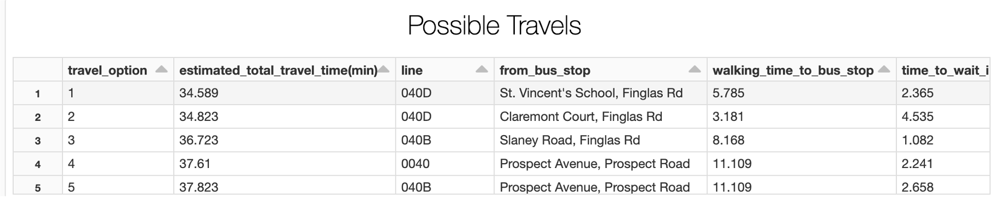
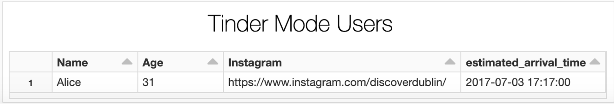

# MooviTinder
MooviTinder Application - Tom Yuviler (tom.yuviler@campus.technion.ac.il) & Lidor Asulin (lidor.asulin@campus.technion.ac.il) - Technion

# Overview
The MooviTinder application helps the user to find the fastest possible way to get from  an origin point in Dublin and to arrive to the desiered desteniation (in Dublin) by using Dublin bus. By activate the Tinder Mode, the user will be able to see other users that chose neraby destination.

## Find the fastest possible travel
By setting the origin point (coordinates: longitude  and latitude) and the destination point (coordinates: longitude  and latitude) by the user the application will show the user the fastest possible travel by using Dublin bus. the calculation of the travel time is based on four different calculations:
1. **Walking time from origin point to the bus station:** The application calculate the distance between the origin point to every bus station in Dublin. The estimated walking time based on the assumption of walking 1 meter per second. The relvant data (accurate locations and names) regarding the bus stations was download from https://data.gov.ie/dataset/bus-stops-served-by-dublin-bus, and was integrated  to the Dublin bus data.
2. **Waiting time in the bus station:** The calculations of the waiting time in the bus station is based on streaming/online data - for each journey pattern of each bus line the application finds the last stop of the bus, and the time that passed from the stop, and integrate it with the estimation of the travel time between two bus stations (based on offline data - read from Elasticsearch - see part 3). 
3. **Travel time between two bus stations:** The application estimates the travel time for each journey pattern of each bus line between each two possible bus stations. In order to calculate that, it uses offline/batch data, by finding the median of the relevant (previous) travel times, considering the day of week and the part of the day (e.g. Monday morning). The estimations are stored in the Elasticsearch platform.
3. **Walking time from the bus stop to the destination point:** As in bullet #1, the application estimates the walking time from the bus station to the destination point according to the assumption of walking speed of 1 m/s.

The final results are showed to the user, with details regarding each phase. The results are sorted (ascended order) by the overall travel time (in minutes). 

## Tinder mode
By activate Tinder mode (Tinder Mode (parameter) = ON), the user will be able to see other users that entered a nearby destination (distance between destinations < 1000 meter) to the application. The user will be able to see the name, age and a link to the Instagram page of other users. It will be noted, that the application will only show users which entered their destination in the same day (as the "main" user).

# How to use the application?
In order to use the application you need to use Databricks. You can choose whether to use the application with streaming data or batch data. In both cases, the user need to set the parameters:
1. **Tinder Mode:** determine whether to see nearby users (ON) or not (OFF). *DEAFULT:* ON
2. **date & time:** the "current" time in format YYY-MM-dd hh:mm:ss (*IMPORTANT:* please enter time between July 2017 and September 2018). *DEAFULT:* 2017-07-03 17:00:00 
3. **origin latitude:** the latitude (coordinates) of the *origin point*. *DEAFULT:* 53.37090049386957
4. **origin longitude:** the longitude (coordinates) of the *origin point*. *DEAFULT:* -6.275353116570684
5. **destination latitude:** the latitude (coordinates) of the *destination point*. *DEAFULT:* 53.34506360456374
6. **destination longitude:** the longitude (coordinates) of the *destination point*. *DEAFULT:* -6.2658641091910585
7. **kafka server ip:** the ip of the kafka server (*IMPORTANT:* relevant only for the streaming version of the application). *DEAFULT:* 10.0.0.30:9091
8. **path file:** the path of the batch date (*IMPORTANT:* relevant only for the batch version of the application). *DEAFULT:* /mnt/dacoursedatabricksstg/dacoursedatabricksdata/busFile

*NOTE:* after setting the parameters, you need to click on the blue <ins>*Update*</ins> button in the top right corner of the application.
## Streaming version - application
https://eastus.azuredatabricks.net/?o=6694791539123117#notebook/2483473424244307/dashboard/3213778479524682/present
## Batch version - application
https://eastus.azuredatabricks.net/?o=6694791539123117#notebook/3213778479524757/dashboard/3213778479524820/present

# Source code
- You can find [here](https://github.com/TomYuviler/MooviTinder/tree/main/code) the source code for the batch version and the streaming version as ipnb notebooks. 
- You can run the notebooks directly from databricks.

